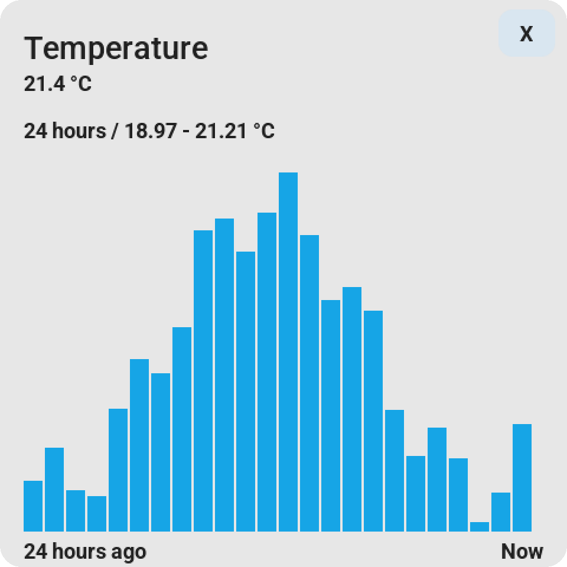
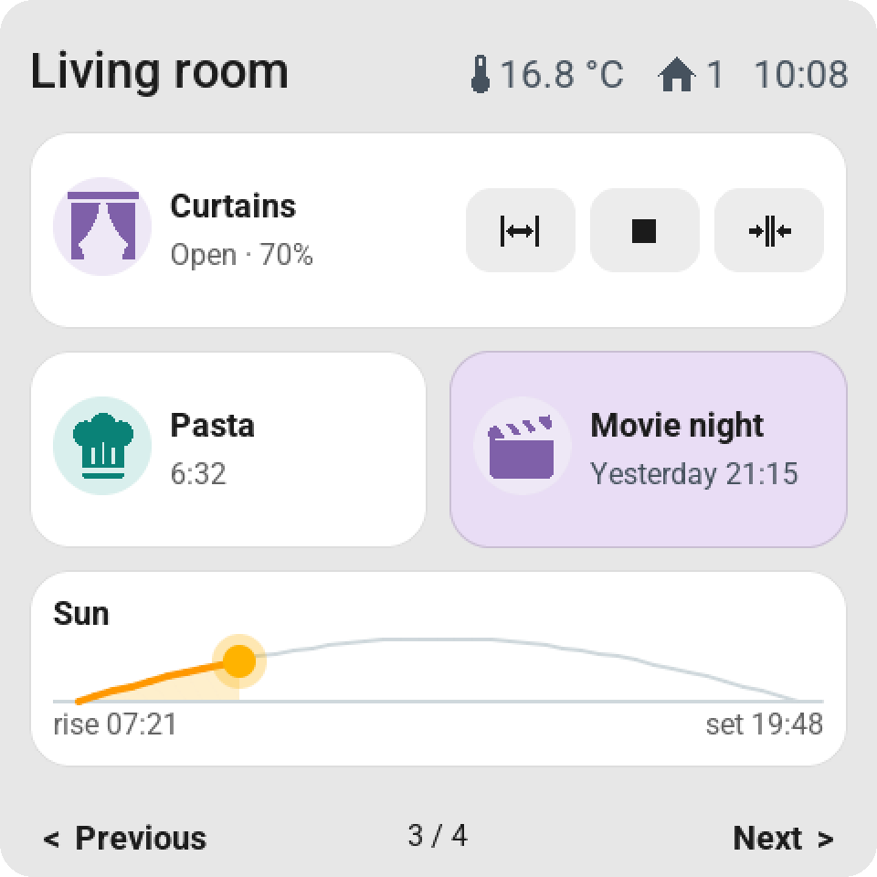
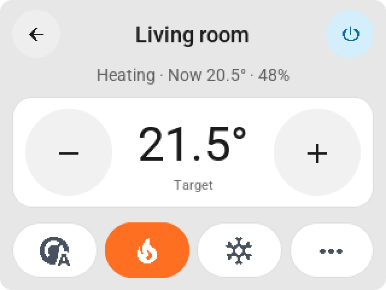

# Home Assistant ESP Screens

A Home Assistant control screen that you lay out yourself. **ESP Screen Manager**
manages your tiles and builds and installs the ESPHome firmware from Home Assistant.
No blueprint, MQTT, or long-lived token needed for normal use.

**New screen? Follow the [complete installation guide](docs/EASY_SETUP.md).**
For every new user and every new device, you create your own profile.

<p align="center">
  
  
</p>
<p align="center">
  
</p>
<p align="center"><sub>A Guition ESP32-S3-4848S040 at home, and the ESP Screens page in Home Assistant with a demo home.</sub></p>

## Supported screens

| Screen | Resolution | Display / touch |
| --- | --- | --- |
| CYD ESP32-2432S028 | 320 × 240 | ILI9341 / resistive XPT2046 |
| Guition ESP32-S3-4848S040, 4 inch | 480 × 480 | ST7701S RGB / capacitive GT911 |

Use these exact board variants: similar-looking product names can have different
controllers or connectors. Wallbox relays are not controlled.
The firmware and built-in CLI are tested with **ESPHome 2026.6.2**.

<p align="center">
  
  
  
</p>
<p align="center">
  
  
  
</p>
<p align="center"><sub>Guition 4-inch, 480 × 480 (top) and CYD 2.8-inch, 320 × 240 (bottom), rendered from the firmware's own LVGL code with a demo home.</sub></p>

## What you can configure

- **Up to twenty tiles**, spread across up to four fixed pages of six
  tiles each. Search by entity, device, or room, and drag to reorder.
- **Per-tile settings:** a custom name, click behavior, a small slider where
  supported, or a large value for things like temperature and power usage.
  From firmware 0.2.13, the large value shows a small domain icon next to the
  title; a number that's too long is truncated with an ellipsis, the unit stays visible.
- **Pastel backgrounds per tile:** choose red for an all-off script,
  green for all-on, or any other color. The title and status stay dark and
  readable. The color also appears in the screen preview; **Default** restores
  the normal colors. Requires firmware 0.2.10 or newer. **None** drops the card
  entirely: the content then sits at the same size directly on the screen background
  (firmware 0.2.16).
- **Clock:** digital or analog. The analog clock has tick marks at 12, 3, 6, and 9
  and, on a single tile, shows a calendar block (weekday, day, month) next to the
  dial; double-width shows the digital time with the date beside it.
- **Light control:** brightness, rainbow color, and white temperature according to
  the light's capabilities. Open the detailed control with a long touch.
- **More cards:** climate, vacuum, fan, cover, media player, sensors,
  select/input_select, number/input_number, switches, scenes, scripts, and
  buttons. A sensor can open a history card for 1, 6, or 24 hours.
- **Special cards (firmware 0.2.14+):** a **clock** (digital or analog)
  as a built-in tile, a **weather forecast** with five days on a
  double-width card, a **graph** of the sensor history in the tile,
  a **sun path** (`sun.sun`: horizon with the sun between sunrise and
  sunset), a **timer** (`timer.*`, tapping starts or pauses it), and
  **presence** (`person.*`). Pick them in the picker like any other tile, or
  drag them straight into the screen mockup; **Double-width** is an option for every tile.
- **Direct control on double-width tiles** (firmware 0.2.19+), like the rows in
  Home Assistant: temperature − / + or mode buttons (climate), a toggle (switch,
  light, fan), start/stop/dock (vacuum), open/stop/close or a
  position slider (cover), volume with mute or previous/play/next (media),
  − / + or a slider (numbers), previous/next (select), start/pause and
  cancel (timer), and a single button for scenes, scripts, and buttons. Configurable
  per tile; **None** keeps the regular card.
- **Weather card** with current weather, the coming hours and days including chance of
  rain or millimeters; **climate card** with an on/off button, mode, fan, and swing settings.
  The target temperature sits big between − / + keys with one row of mode keys below; the
  Guition shows fan and swing right away on a card of their own, the CYD behind ···.
- **Vacuum card** with the state, battery and charging, start and dock, and how the robot
  cleans: **vacuum, vacuum and mop, or mop only** for robots that offer a cleaning mode in
  Home Assistant (such as Roborock), then suction and water. Only the rows the chosen mode
  uses are shown (app 0.2.46 / firmware 0.2.39).
  Scenes, scripts, and buttons show when they last ran. A tile that's waiting on
  Home Assistant shows a small spinner on a light overlay.
- **Top bar per screen** (firmware 0.2.32+): the name on the left, up to six
  items of your choice on the right: the time, an analog clock, the date, or an
  entity from Home Assistant with an icon, such as temperature, humidity, power usage, a door
  (open/closed), the alarm, who's home, or when something or someone last
  changed ("5 min ago", "Yesterday"). See [Top bar](#top-bar).
- **Screen settings:** standby time, normal and dimmed brightness,
  night hours, 24- or 12-hour clock, return to the home page, and optional swiping
  between pages. Home Assistant automations can turn **Auto standby** off and on per
  screen (firmware 0.2.41+), for example to keep a screen on while someone is home.
- **Guition rotation:** 0°, 90°, 180°, or 270°, directly from the management page.
  Native LVGL rotation turns the display and touch together. The CYD keeps its fixed
  orientation and its own calibration.
- **Inspector:** check entities, status, and configuration in ESP Screens.
  Action feedback shows that a command is on its way.

<p align="center">
  
  
  
</p>
<p align="center">
  
  
  
</p>
<p align="center">
  
  
</p>

Features depend on the capabilities Home Assistant reports for an entity.
The app must keep running to keep the screens supplied with current data.

From firmware **0.2.12**, a long press on a switch shows a large
toggle. A short tap switches immediately; the off state gets a gray icon.
The feedback stops as soon as Home Assistant reports the changed state, with a
minimum of 150 ms for switches. Tiles with a mini-slider keep their
icon; on the CYD, the icon and text block are vertically centered.

## Alert from an automation

<p align="center">
  
  
</p>

Every screen has the action **`esphome.<screen>_show_alert`** (firmware 0.2.31+). It places
a card over the entire screen, wakes the screen, and keeps the backlight at normal
brightness until someone taps **OK**. In an automation:

```yaml
action: esphome.kitchen_screen_show_alert
data:
  title: "Someone is at the door"
  subtitle: "Door 3, back"
  icon: doorbell
  color: orange
  button_text: "Coming"
  timeout: 0
  flash: true
```

- **`title`** and **`subtitle`**: a single-line title (truncated with an ellipsis if too long) and an
  explanation that wraps across multiple lines. Empty is allowed; an empty title becomes "Notification".
- **`icon`**: a name from the tile picker, such as `doorbell`, `bell`, `alert-outline`,
  `lock`, `door-open`, `motion-sensor`, `smoke-detector`, `water-alert`, `mailbox`, `car`,
  or `account`. `mdi:doorbell` and the hex codepoint (`F12E6`) also work, as long as the glyph
  is included in the firmware. Unknown falls back to the warning triangle.
- **`color`**: `red`, `orange`, `yellow`, `green`, `mint`, `blue`, `purple`, `pink`, or
  `gray` — the same pastel shades as the tiles. Empty gives the white card.
- **`button_text`**: the text on the button; empty is "OK".
- **`timeout`**: seconds after which the card disappears on its own; `0` means it waits for the button,
  however long that takes. The button always closes the card immediately, even with a timeout. Standby and
  night mode wait as long as the card is showing.
- **`flash`**: `true` makes the backlight blink four times when the alert arrives.

In ESP Screens, **Settings → Alerts** opens a cheatsheet with the exact action name for each screen,
a ready-to-paste example, and all fields, icons, and colors. Home Assistant asks for all seven fields; leave a field empty (`""`, `0`, `false`) if you
don't use it. A new alert replaces the current one. Every end is reported as the event
**`esphome.screen_alert`** with `action` (`ok`, `timeout`, `replaced`, or `remote`), `title`,
`screen`, and the `device_id` that Home Assistant adds, so an automation can wait for OK.
**`esphome.<screen>_dismiss_alert`** clears the card remotely.

### All screens at once

From app 0.2.45, one event reaches every screen that is online, screens you add later included.
ESP Screen Manager passes it on to each screen's `show_alert` action. The fields are the same;
the ones you leave out stay empty:

```yaml
actions:
  - event: esp_screens_show_alert
    event_data:
      title: "Mail!"
      subtitle: "There is post in the mailbox"
      icon: mailbox
      color: orange
      timeout: 0
      flash: true
```

**`esp_screens_dismiss_alert`** clears the alert on every screen. The app has to be running
for these two events; the per-screen actions work without it.

### Ask Claude

Use Claude Code in Home Assistant? **Settings → Claude → Install for Claude Code** writes an
ESP Screens skill to `/homeassistant/.claude/skills/esp-screens`, so Claude knows these events
and every field, color, and icon. Then ask, for example: "Show an alert on all my screens when
the mailbox is full." **Download for claude.ai** gives the same skill as a zip to upload in
Claude under Customize → Skills. Nothing is written until you press the button.

<p align="center">
  
</p>

## Installing from Home Assistant

### Do I need ESPHome?

**You don't need to install the separate ESPHome Device Builder app.**
ESP Screen Manager already includes the ESPHome CLI and can build firmware itself,
install it via USB, and later update it wirelessly over OTA.

**You do need to pair the flashed screen via the ESPHome integration in HA.**
That pairing lives under **Settings → Devices & services**, not in the
App store. Add the discovered device there. If it doesn't appear automatically,
choose **Add integration → ESPHome** and enter the screen's IP address.
If asked for a key, use the `api.encryption.key` from your own device YAML,
and grant the device permission to perform Home Assistant actions.

| Component | Needed? | What for? |
| --- | --- | --- |
| ESP Screen Manager app | Yes, for this installation route | Installing firmware, managing tiles, and sending current data to the screen |
| ESPHome Device Builder app | No, optional | Alternative editor and firmware installer; the same CLI is already in ESP Screens |
| ESPHome integration in HA | Yes, pair every screen | The connection between Home Assistant and the physical screen |

So a fresh installation without ESPHome Device Builder also works. If there's
no ESPHome `secrets.yaml` yet, our wizard asks for Wi-Fi once and
stores it locally. Existing Wi-Fi secrets are reused. API and OTA keys
are generated per new screen and stay in that device's own profile.

### Step by step

For Home Assistant OS with Apps/Add-ons on **aarch64 or amd64**:

1. Open the App store and add this repository:
   `https://github.com/MaxGramser/homeassistant_espscreen`.
2. Install **ESP Screen Manager**, start the app, and open **ESP Screens**.
   ESPHome Device Builder is optional: the ESPHome CLI is already in this app.
3. Connect the screen with a USB data cable to the **Home Assistant machine**
   and choose **Settings → New screen**: CYD or Guition, a name, the USB port, and
   **Install**. If Wi-Fi is missing from the ESPHome `secrets.yaml`, the window
   asks for it once and ESP Screens only adds the missing lines. The profile
   with unique API and OTA keys goes into the ESPHome folder; the build
   and flash run in the same window (a first build takes a few minutes on a
   Raspberry Pi). Each screen gets its own profile.
4. **CYD:** go through the calibration on the screen. **Guition:** uses GT911
   without resistive calibration. Then pair the discovered ESPHome device in
   **Settings → Devices & services** using the API key the window
   shows after installation (copy button). Grant the device permission to
   perform Home Assistant actions.
5. Select the screen in ESP Screens, choose your tiles, and click
   **Save & send to screen**. Then test the physical controls.

<p align="center">
  
  
</p>
<p align="center"><sub>New screen (step 3) and choosing your tiles (step 5).</sub></p>

You can install new firmware later from **Settings → Firmware & USB → Wi-Fi / OTA**.
For an existing screen, always use the existing profile; creating a new
installation profile generates new keys.

## Customizing tiles and colors

Click a tile in the screen preview. Under **Pastel background**, choose a color,
such as red or green. Optionally adjust the name, click action, mini-slider, or large
value. Click **Save & send to screen** to apply the changes.
After the first supporting firmware update, this requires no new flash.

<p align="center">
  
  
</p>
<p align="center"><sub>The settings of the Heating tile, and that tile on the screen: double-width with temperature − / +.</sub></p>

A color is a fixed choice for that tile: it stays red, for example,
even when you run the all-off script. The entity status and action feedback
stay separately visible.

## Top bar

At the top of the editor, each screen has its **Top bar**: the name on the left, up to
six items on the right. **＋ Add** offers the time, an analog clock, and the date (which
keep ticking on the screen itself, even without Home Assistant), suggestions from your own
home (temperature and power usage from the screen's room, the weather, how many people are home,
sunrise and sunset), and a search field for any entity, including a phone
(`device_tracker`), a lock, the alarm panel, or `zone.home`. Drag the items
to change their order; tap one to configure it:

- **What to show:** the state as Home Assistant writes it (21.3 °C, 65%,
  1,249 W, Open/Closed, Home/Away, Armed away), or **Last changed**: "Just now",
  "5 min ago", "Yesterday". A timestamp sensor can also count forward ("In 2 hours").
- **Icon:** automatic, matching Home Assistant (an open door gets an open-
  door icon), a custom icon from the list, or no icon.
- **Show:** always, or **only when active**: the item only appears when it's
  on, open, home, or greater than 0. Handy for an open door or a running
  washing machine. Active items are colored like in Home Assistant (open door amber,
  alarm armed green, alarm triggered red).

<p align="center">
  
  
</p>

The screen preview draws the bar with the same letters and rules as the screen:
all values on one line with the name, icons aligned to digit height, equal spacing.
If not everything fits next to the name, the name gets an ellipsis and the screen drops the
leading items; the editor marks those with dashes. Until updated, older firmware shows
only the name and the time (if that's in the bar).

## Updates and keeping your settings

| Change | Action |
| --- | --- |
| Tiles, names, colors, order, or screen settings | Save in ESP Screens; no firmware flash |
| New version of the management page | Update ESP Screen Manager in the HA App store |
| New feature on the physical screen | The **Update** button on the screen (badge *Update x.y.z*), or **Update automatically every night** under Settings |

Every app version belongs to one firmware version. After an app update, the list
shows per screen whether newer firmware is available. **Update** builds that screen's own profile
with the built-in CLI, installs it wirelessly, and waits until the screen is back.
With the checkbox enabled, that happens automatically at night, one screen at a time; a
failure stops the round and posts a notification in Home Assistant. Firmware
0.2.17+ reports its own device name and IP address for this; an older screen asks
for the IP address once. You can still do it manually via Settings → Firmware & USB → Wi-Fi / OTA.

The device's own YAML and Wi-Fi/API/OTA settings stay in the ESPHome config folder.
Tile layouts and options live in the app's persistent data. CYD calibration and
screen preferences stay stored on the device. Updates don't replace this
user data. Do still make normal Home Assistant backups and keep your
device profiles; removing an app or wiping flash memory is not an update.

**Efficient, even with many screens (0.2.39 / firmware 0.2.33).** The app sends a
screen only the tile that changed, as a single action
(`esphome.<device_name>_screen_message`) instead of chunks in a text field.
Every two minutes, a small ping follows with the layout revision; if the
screen reports that it doesn't match (after a restart, for example), everything is resent.
Graphs on sensor tiles come from Home Assistant's statistics, in one
query for all screens. Older firmware still works via the text field and the
full resend every two minutes. The diagnostic sensor `Uptime` has been
replaced by the `Last boot` timestamp.

See the [release history](screen_manager/CHANGELOG.md) and
[releases and protocol compatibility](docs/RELEASING.md).

**If you publish your own fork:** every push to GitHub is a release. Always also
bump the add-on version in `screen_manager/config.yaml` and log the change in
the CHANGELOG, otherwise the HA App store won't offer an update. A change to the
screen also gets a new `SCREEN_FIRMWARE_VERSION` in both board profiles.

## Guides and installation help

- [Complete installation from ESP Screens](docs/EASY_SETUP.md)
- [Guition hardware, mounting, and rotation](docs/GUITION.md)
- [CYD calibration and USB diagnostics](docs/CALIBRATING.md)
- [Physical acceptance test](docs/ACCEPTANCE.md)
- [Instructions for developers and LLMs](AGENTS.md)

Give a developer or LLM a clean copy of this repository and, for example:

> Read AGENTS.md, README.md, and docs/EASY_SETUP.md. Help me install this CYD or
> Guition screen via USB on my Home Assistant. Identify
> the board and use my existing profile if one already exists. Guide me through
> calibration, HA pairing, tile selection, and physical tests. Keep keys local,
> and state which checks were actually carried out.

A successful build doesn't prove the physical touch or panel image is correct. The owner
must check the display and perform the requested taps.

<details>
<summary>Older manual CYD installation via a computer</summary>

The route below uses the older manual profile with up to ten
tiles. Its position constraints don't apply to ESP Screen Manager's twenty
runtime tiles. For new installations, prefer the route
above; the manual instructions remain available for maintenance.

# CYD Home Assistant control screen

From a fresh **ESP32-2432S028 with ILI9341 + XPT2046** to a calibrated
Home Assistant screen, over USB. With light control, scenes/scripts, climate,
vacuum, up to ten tiles, and fixed pages. With six tiles or fewer,
pagination disappears. Standby starts after ten minutes by default.

**Manual installation via a computer:** you don't need to create a Home Assistant token
or install an ESPHome add-on to flash from a computer.

## Working with an LLM or developer

Give it the unpacked folder and this prompt:

> First read AGENTS.md and README.md. Guide me through a new installation
> on an ESP32-2432S028 connected via USB, with my own Home
> Assistant. Check the board, the serial port, and the Python environment.
> Create a local device.yaml profile; don't use any existing personal
> entities or panel calibration. Walk through USB calibration, HA pairing,
> tile configuration, and the acceptance test. Ask me for physical taps when
> needed. Keep keys and passwords in local files, and report
> which checks were actually carried out.

The assistant can read the code and logs, but can't see the physical screen
on its own. You check the display and perform the requested taps.

## 1. Check what you need

- The intended board: ESP32-2432S028, 320×240, **ILI9341 display and resistive
  XPT2046 touch**. Boards exist with almost the same name and a different
  display controller. This guide doesn't cover those variants.
- A USB **data cable** and a computer running macOS, Linux, or Windows.
- Python **3.11–3.14**, internet access for the first build, and a few GB of free space.
  The version limit comes from the tested ESPHome package; don't use Python 3.15.
- A 2.4GHz Wi-Fi network; Home Assistant must be able to reach the board over
  the network. Keep the Wi-Fi password available locally.
- Access to Home Assistant to choose entities and add ESPHome.

Preferably keep only one ESP board connected at a time. Note the variant and
the MAC address from the boot/upload logs.

## 2. Set up the work environment

Clone [the repository](https://github.com/MaxGramser/homeassistant_espscreen)
or unpack the starter ZIP. Open a terminal **in the code folder**. All commands below
are run from that folder.

macOS/Linux:

```sh
python3 -m venv .venv
source .venv/bin/activate
python -m pip install --upgrade pip
python -m pip install -r requirements.txt
```

Windows PowerShell:

```powershell
py -3.13 -m venv .venv
.\.venv\Scripts\Activate.ps1
python -m pip install --upgrade pip
python -m pip install -r requirements.txt
```

If activating PowerShell is blocked, use
`.\.venv\Scripts\python.exe` directly instead of `python`; no system change is
needed. Then check:

```sh
python --version
python -m esphome version
python -m serial.tools.list_ports
```

Expect **ESPHome 2026.6.2**. This repo includes a custom touch driver that's
tested against this version. Don't silently upgrade during an installation.
See also the [official ESPHome installation guide](https://esphome.io/install/).

Note the port: for example `/dev/cu.usbserial-130` on macOS,
`/dev/ttyUSB0` on Linux, or `COM3` on Windows. Further down, `<USB_PORT>`
appears; always replace it with the actual port, without angle brackets.

## 3. Create your own device profile

Choose a unique name, for example `display-kitchen`:

```sh
python tools/new_device.py --name display-kitchen --friendly-name "Display kitchen"
```

This creates three local files and overwrites nothing:

| File | What you edit in it |
|---|---|
| `device.yaml` | Device name, room, tiles, and behavior |
| `calibration.yaml` | Calibration for this one physical panel; the wizard writes this |
| `secrets.yaml` | Wi-Fi, API encryption key, OTA and fallback password |

The keys are generated uniquely. In `secrets.yaml`, only fill in your
`wifi_ssid` and `wifi_password`. Leave the generated keys as they are and
keep this file with your own configuration. Don't include it in the ZIP.
You'll need the API encryption key later for HA pairing; copy it
locally from the file, not through a public chat.

Do these files already exist? Work in a new copy of the folder for a new
screen. Don't erase the keys/calibration of a working screen.

`device.yaml` imports the base configuration and your calibration. It also overwrites
**all hidden tile positions**, so they don't keep tracking someone else's
entities. Start with the six example tiles. `DIRECT_ACTIONS: "false"`
prevents direct HA control during the initial installation. At this
stage, don't yet create HA automations that react to the action sensor.

## 4. First USB flash and calibration

First check the configuration (ESPHome masks secrets by default):

```sh
python -m esphome config device.yaml
```

Flash calibration mode, which works without an HA connection:

```sh
python -m esphome -s CALIBRATION_ON_BOOT true run device.yaml --device <USB_PORT>
```

The first build can take several minutes. After uploading, five
crosshairs appear on a dark screen. `run` keeps showing logs: stop **only the
log reader with Ctrl+C** before starting the calibration wizard. The board stays on.

Now follow [docs/CALIBRATING.md](docs/CALIBRATING.md): three taps are
collected per target, the four corners determine the correction, and the center is an
independent check. Then you flash the result and measure again.
**Never copy the measurements from another panel.**

## 5. Pair with Home Assistant

After a successful calibration, flash the normal mode:

```sh
python -m esphome run device.yaml --device <USB_PORT>
```

Check the logs for the Wi-Fi IP, a stable boot, and the device name. Ctrl+C closes
the log reader. The screen should now show the normal tile page.

1. In HA, open **Settings → Devices & services**.
2. Choose the discovered ESPHome device, or **Add integration → ESPHome**.
3. Use `display-kitchen.local` or the IP address from the logs; API port **6053**.
4. Enter the `api_encryption_key` from your local `secrets.yaml` if asked.
5. Check that the device name is correct and the status becomes online.
6. Open this ESPHome integration's options/configuration and enable
   **Allow the device to perform Home Assistant actions**.

The exact wording/location of this option varies by HA version. See the
[official integration guide](https://www.home-assistant.io/integrations/esphome).
The HA integration connects to the board; the ESPHome Device Builder/add-on is
optional and is a separate feature.

## 6. Configure your own tiles

Follow [docs/TILES.md](docs/TILES.md). Collect the real entity IDs in HA,
check supported attributes/actions, and edit `device.yaml`. Use
short titles. Once you've checked everything:

```yaml
substitutions:
  DIRECT_ACTIONS: "true"
  TILE_COUNT: "6"
```

These are changes in the **existing** substitutions map, not a second map
at the bottom of the file. Build and flash again with `run device.yaml`. The tiles
will then follow the real HA state. An active API connection alone
doesn't prove that HA has been granted permission for actions.

## 7. Handover and testing

Run through [docs/ACCEPTANCE.md](docs/ACCEPTANCE.md). That covers an independent
touch measurement, both pages if present, long press, sliders, climate,
vacuum, real HA state, and the correct action effects. The built-in
render test doesn't control any HA devices itself:

```sh
python diagnostics/run_ui_test.py --host display-kitchen.local --name display-kitchen
```

Keep with this person: `device.yaml`, `calibration.yaml`, `secrets.yaml`, the
measurement files, the ESPHome version used, and a short handover report.
For later updates you can keep using USB or use OTA:

```sh
python -m esphome run device.yaml --device display-kitchen.local
```

Don't change the name/API key without also updating the HA pairing.
For troubleshooting: [docs/TROUBLESHOOTING.md](docs/TROUBLESHOOTING.md).

## Handing this code to the next person

Use the exporter instead of copying your entire working folder:

```sh
python tools/export_bundle.py --output dist/cyd-starter.zip
```

The ZIP contains the code, local fonts, licenses, guides, and neutral
examples. The base defaults are neutralized for the recipient.
No `secrets.yaml`, personal `device.yaml`, measurements, logs, `.git`, `.esphome`,
Python environment, or firmware backups. The exporter refuses to overwrite an
existing ZIP; choose a different filename for a new version.

The original base is from
[akuehlewind/ESPHome-touch-display-mount](https://github.com/akuehlewind/ESPHome-touch-display-mount).
Project, ESPHome driver, and font licenses are in `LICENSE`,
`components/xpt2046/LICENSE`, and `fonts/` respectively. Historical board diagnostics are in
[CYD_STABILITY.md](CYD_STABILITY.md); for a **new** installation, follow the
guides above.

</details>
